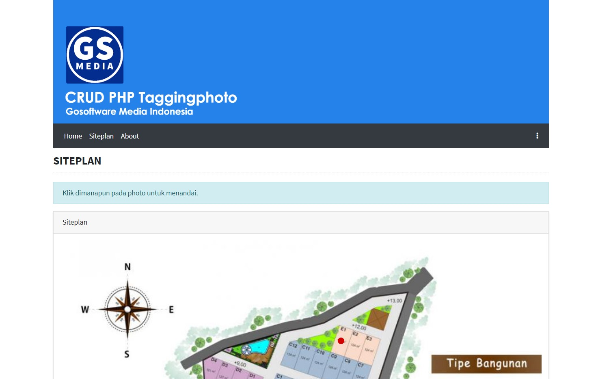

# CRUD PHP Taggingphoto
Simple Taggingphoto with PHP using Jquery, PDO and Database SQLite.

## Update
1. Composer Ready
2. PHP 7.4 Ready
3. Simple Router
4. Bootstrap 4.4.1
5. DataTables 1.10.18
6. jQuery v3.4.1
7. Font Awesome 4.7.0

## Installation
```sh
git clone https://github.com/suendri/free-crud-php-taggingphoto.git
install Database db/install.php
set RewriteBase on .htaccess based on folder name
```
## Donation
Please read DONASI.txt

